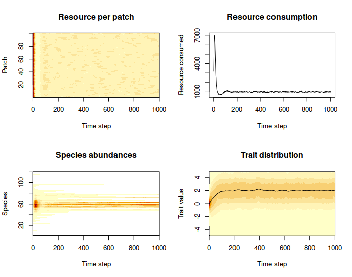

# FilterABM: An agent-based model of trait-based environmental filtering

***Oleksii Dubovyk***

*Department of Biological Sciences, Old Dominion University, Norfolk, VA, 23529, USA*

An agent-based model that includes a simplified case of environmental filtering with one abstract trait, one abstract environmental factor, and one abstract resource. 
The model attempts to predict the abundance and trait distribution in a local community shaped by the processes of community assembly, niche clustering, and dispersion.

## Installation

There is no current plan to submit this package to CRAN.

You can install the package directly from GitHub:

```r
if(!require("devtools")) install.packages("devtools")
devtools::install_github("OleksiiDubovyk/FilterABM")
```

The package was developed in `R 4.4.2` and uses the following packages:

- `dplyr >= 1.1.4`
- `tibble >= 3.2.1`
- `magrittr >= 2.0.3` (note that it still uses the `%>%` pipe, not the new native `|>`)
- `grDevices >= 4.4.2`
- `graphics >= 4.4.2`
- `stats >= 4.4.2`
- `progress >= 1.2.3`
- `ggplot2 >= 3.5.2`

The package was built with the help of 
[`devtools 2.4.5`](https://devtools.r-lib.org/), 
[`usethis 3.1.0`](https://usethis.r-lib.org), 
[`testthat 3.2.3`](https://testthat.r-lib.org), 
[`roxygen2 7.3.2`](https://roxygen2.r-lib.org/), 
all in Posit RStudio 2024.12.0+467.

## Usage

### 1. Initialize the simulated objects

```r
# Create the metacommunity
# mc <- init_meta() # will suffice, or you can specify parameters
mc <- init_meta(env_mean_mc = 0, env_sd_mc = 1, cauchy = 1, trait_sds = 0.5)
# Create the local habitat
# lh <- init_envt(npatch = 100) # will suffice, or
lh = init_envt(env_mean_lh = 2, env_sd_lh = 0.1, npatch = 100, gradient = "random")
# Draw the initial local community
lc = draw_lcom(mc = mc, lh = lh, nind = 10000)
```
### 2. Run simulation for the desired number of time steps

```r
# run the simulation
# beware - it takes some time
runsim <- run_sim(mc = mc, lh = lh, lc = lc, 
  nsteps = 1000, 
  progress_bar = T, 
  recruitment = 0, dispersal = 10, 
  res_input = 10, 
  age_crit = 10, mass_crit = 1.25)
# view the results over time
plot_run_sim(runsim)
```


## Structure

For the sake of formality, this package is implementing the R's S3 object-oriented system.

### Objects

The "objects" on which the package operates are based upon `dplyr`'s tibble data structure, thus allowing for application of standard tools from `dplyr`.

#### **Metacommunity**

Class defined as `"FilterABM_mc"`. The metacommunuty object is represented as a table with the following columns:

- `species`: integer, species ID,
- `trait`: double, species-specific mean trait value,
- `abundance`: integer, species' abundance within the metacommunity,
- `trait_sd`: double, non-negative intraspecific trait variation (e.g., an individual drawn from this metacommunity will have the trait value defined as such as drawn from $`\mathcal{N}(\mu = \text{trait}, \sigma^2 = \text{trait\_sd})`$).

**Initialize** a new metacommunity object with [`init_meta()`](R/init_meta.R).

Formal ***constructor & validator***: [`FilterABM_mc()`](R/FilterABM_mc.R).

##### Methods

Quick look at the metacommunity object.

```r
summary(init_meta())
#> A metacommunity of 120 species.
```

Print out a plot of species abundance distribution within a metacommunity and trait structure by individuals and by species.

```r
plot(init_meta())
```


Note that plotting the trait-abundance distribution (purple) takes some time since every individual trait value is simulated. 
The distribution has a weird disrupted shape if `trait_sd`s are equal to zero, which is typical for samples drawn from a Cauchy distribution.
Notice how it changes if `trait_sd`s are non-zero.

#### **Local habitat**

Class defined as `"FilterABM_lh"`. The local habitat object is represented as a table with the following columns:

- `patch`: unique integer, patch ID,
- `env`:  double, patch-specific level of the environmental factor,
- `res`: non-negative numeric, resource level.

Resource level is supposed to change over time, as individuals consume it and it gets replenished at a specified rate. 
To implement this fact, the `"FilterABM_lh"` gets mutated every time step directly in the global environment. 
This means that the `"FilterABM_lh"` object must exist in the local environment during the simulation.

**Initialize** a new local habitat object with [`init_envt()`](R/init_envt.R).

Formal ***constructor & validator***: [`FilterABM_lh()`](R/FilterABM_lh.R).

##### Methods

Quick look at the local habitat object.

```r
summary(init_envt())
#> A local habitat with 10 patches, random gradient.
```

Plot the "spatial" unidimensional distribution of environmental levels across patches in the local habitat.

```r
plot(init_envt())
```


- `lh_input_res(lh = init_envt, res_input = 10)` replenishes resource level in the local habitat object by an increment of `res_input`.

#### **Local community**

Class defined as `"FilterABM_lc"`. The local community object is represented as a table with the following columns:

- `species`: integer, species ID,
- `trait`: double, individual trait value,
- `age`: positive integer, individual's age in time steps,
- `mass`: double, individual's body mass,
- `lifespan`: double, maximum lifespan allowed for the individual,
- `repmass`: double, critical mass at which the individual will reproduce,
- `patch`: integer, ID of the local habitat patch in which the individual resides.

The initial local community cannot be initialized from scratch (e.g., like `init_meta()` or `init_envt()`), but has to be drawn from the metacommunity into the local habitat.

Formal ***constructor & validator***: [`FilterABM_lc()`](R/FilterABM_lc.R).

##### Methods

Plot the trait distribution of the local community, where each color corresponds to a different species.

```r
plot(lc)
```


The whole package pretty much rotates around a `"FilterABM_lc"`, constantly mutating it:

- `draw_lcom(mc = mc, lh = lh)` creates an initial local community with a random draw from the metacommunity `mc`,
- `recruit(lc = lc, mc = mc, lh = lh)` adds freshly recruited individuals from the metacommunity `mc` into the local community `lc`,
- `adv_age(lc = lc)` advances age of all individuals in the local community `lc` by one time step,
- `dem(lc = lc, mc = mc)` eliminates all individuals whose age exceeds their maximum lifespan and 
simulates asexual reproduction of individuals whose body mass reached their critical reproductive mass, 
allowing for trait heredity across generations,
- `disperse(lc = lc, lh = lh)` changes patch ID assignment for a random subset of individuals, simulating patch-to-patch dispersal,
- `forage(lc = lc, lh = lh, R = 1000)` simulates individuals consuming the resource in `lh`, thus returning a list of the local community and the local habitat with updated resource level.
