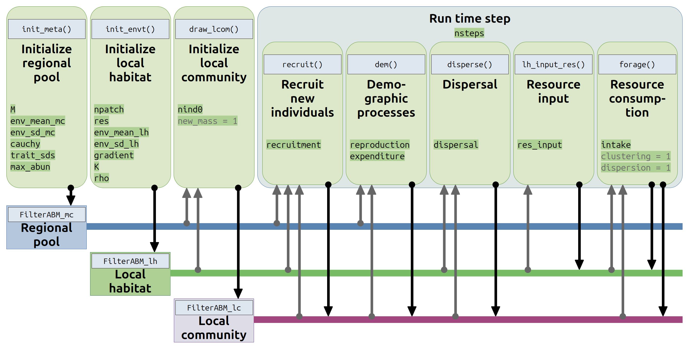
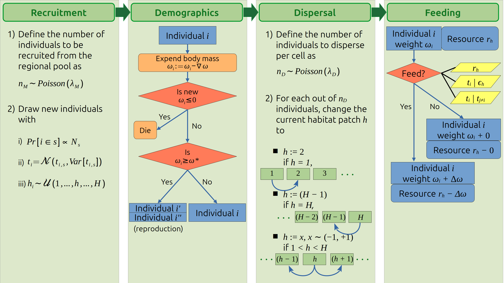

```{r, include = FALSE}
knitr::opts_chunk$set(
  collapse = TRUE,
  comment = "#>"
)
options(rmarkdown.html_vignette.check_title = FALSE)
```

```{r setup, echo=F, message=FALSE}
# package-specific
library(dplyr)
library(tibble)
library(magrittr)
library(grDevices)
library(graphics)
library(stats)
library(progress)
library(ggplot2)

# vignette-specific
library(forcats)
library(bookdown)
library(knitr)
library(kableExtra)

# install the package

# intall.packages("devtools")
# devtools::install_github("OleksiiDubovyk/FilterABM")
library(FilterABM)
```

<font size="1">The ODD protocol follows recommendations of Grimm et al. ([2020](https://doi.org/10.18564/jasss.4259))</font> 

# Purpose and patterns

This model is intended to illustrate how the interaction of environmental factors and organismal functional traits interact predicting the composition of a local ecological community. 
Individual trait values determine whether an individual recruited from a regional pool into the local community consumes habitat resources effectively: an individual is more likely to consume the resource if its trait value matches the local environmental factor (niche clustering) and if there are few individuals present in the habitat that share a similar trait value (niche dispersion). 
If there is a considerable mismatch between the individual trait value and the local conditions, the individual is unlikely to be able to consume the resource (e.g., it is too cold to forage); likewise, individuals with similar trait values compete for the resource, reducing the likelihood of successful foraging. 
All individuals must consume the resource to gain enough weight to reproduce.
The amount of resource comsumed by an individual is equal to body weight gain within a time step.
Individuals expend a fixed amount of their body weight to survive through a time step.
Failure to consume enough resources to balance this expenditure results in the individual's death.

# Entities, state variables, and scales

All notations used across the model and the state variables are listed in Table \@ref(tab:table1). 
The agents in the model are characterized by their species identity, individual trait value, age, body mass, body mass at reproduction, and maximum lifespan.

```{r tab1, echo=FALSE, eval=TRUE}
tab1 <- tibble(
  entity = c(
    rep("Index", 3),
    rep("Regional pool", 8),
    rep("Local habitat", 7),
    rep("Individual", 4),
    rep("Global simulation parameters", 7)
  ) %>%
    as.factor(),
  Notation = c(
    "$s$", "$h$", "$i$",
    "$M$", "$N_s$", "$\\max[N_s]$", "$\\mu$", "$\\sigma^2$", "$\\gamma$", "$\\bar{t_{i, s}}$", "$Var[t_{i, s}]$",
    "$H$", "$\\bar{\\epsilon_h}$", "$Var[\\epsilon_h]$", "$K$", "$Cor(h, \\epsilon_h)$", "$r_h$", "$\\epsilon_h$",
    "$s_i$", "$t_i$", "$h_i$", "$\\omega_i$",
    "$\\lambda_M$", "$\\lambda_D$", "${\\omega}^*$", "$\\nabla \\omega$", "$\\Delta \\omega$","$\\Delta r$", "$N_{init}$"
  ), 
  `Code notation` = c(
    "", "", "", 
    "`M`", "", "`max_abun`", "`env_mean_mc`", "`env_sd_mc`", "`cauchy`", "", "`trait_sds`",  
    "`npatch`", "`env_mean_lh`", "`env_sd_lh`", "`K`", "`rho`", "`res`", "", 
    "", "", "", "",
    "`recruitment`", "`dispersal`", "`reproduction`", "`expenditure`", "`intake`", "`res_input`", "`nind0`"
    ),
  Description = c(
    "species", "habitat patch", "individual",
    
    "species richness in the regional pool", 
    "regional abundance of a species $s$",
    "regional abundance of the most abundant species",
    "regional mean of the environmental factor", 
    "regional variation of the environmental factor",
    "shape of the Cauchy function mapping species abundance distribution through trait abundance distribution",
    "species-specific mean trait",
    "intraspecific trait variation",
    
    "number of habitat patches within the habitat",
    "mean environmental factor value across patches",
    "variation of the environmental factor value across patches",
    "if gradient is clustered, number of clusters", 
    "if gradient is correlated, correlation between the patch location and the environmental factor",
    "resource available within the patch $h$",
    "environmental factor at the patch $h$",
    
    "species to which the individual belongs",
    "individual trait value",
    "patch identifier in which the individual resides",
    "current individual body mass",
    
    "mean rate of recruitment of new individuals from the regional pool into the local community, per patch",
    "mean rate of individuals moving to a neighboring habitat patch, per patch",
    "body mass at which individuals reproduce",
    "amount of body mass an individual must expend to survive a time step",
    "maximum resource amount an individual can consume per time step",
    "resource regeneration rate, per patch",
    "number of individuals drawn from the regional pool at initialization"
  ),
  `Default value` = c(
    "–", "–", "–",
    "$[2, 500]$", "–", "$10^6$", "$0$", "$[0.1, 10]$", "$[0.1, 25]$", "–", "$[0, 1]$",
    "$[10, 100]$", "$[0, 10]$", "$[0.1, 10]$", "$3$", "$0.75$", "–", "–",
    "–", "–", "–", "–", 
    "$[0, 10]$", "$[0, 10]$", "$[0.5, 10]$", "$[0.1, 2]$", "$[0.05, 2]$", "$[0.1, 20]$", "$10^4$"
  ),
  `Is state variable?` = c(
    rep("–", 16), "Y", rep("–", 3), "Y", "Y", rep("–", 7)
  )
)

t1 <- knitr::kable(tab1[-1], escape = F, 
                   caption = "List of used symbols in the model description and their default values", 
                   label = "table1",
                   booktabs = TRUE, format = "html", align = "cclc")
t1 <- t1 %>%  
  kableExtra::group_rows(index = table(fct_inorder(tab1$entity)), bold = T)
```


```{r table1, echo=FALSE, message=FALSE, warnings=FALSE, results='asis'}
t1
```

The model consists of three major components: (1) regional pool, (2) local habitat, and (3) local community (Table \@ref(tab:table2)). 
The regional pool is immutable and contains the information about the finite and exhaustive set of $M$ species in the model, their regional abundances, and intraspecific trait mean and variation. 
Species abundances in the regional pool are presumed to be so large in comparison with the local community that they are not affected by the local community and remain constant throughout the simulation. 
Trait means across species in the regional pool follow a Gaussian distribution with some mean $\mu$ and variation $\sigma^2$; trait means are mapped into species abundances through a Cauchy function with the shape parameter $\gamma$.

The simulation runs are constrained within a local community into which individuals are recruited from the regional pool.
This local community exists within a local habitat. 
The local habitat is modeled as a set of $H$ discrete habitat patches indexed as ${1, 2, \cdots, h, \cdots, H}$. 
Every habitat patch $h$ has its resource level ($r_h$) independent of other habitat patches, which is renewable at a constant rate $\Delta r$ (equal for all habitat patches). 
Habitat patches of the local habitat are organized into a unidimensional sequence. 
The entire local habitat has some mean value of an environmental factor across patches ($\bar{\epsilon_h}$) and the respective variation ($Var[\epsilon_h]$). 
Four possible scenarios of spatial distribution of the environmental factor across habitat patches can be simulated (see [Initialization 5.2](#spatial) for details): (1) random, (2) clustered, (3) correlated, or (4) linear.

The local community is a set of live individuals inhabiting the local habitat. New individuals are either recruited from the metacommunity or are “born” through asexual reproduction of previous generations of individuals. 
The rate of recruitment $\lambda_M$ of new individuals from the regional pool is constant throughout the simulation; the trait value of each newly recruited individual is drawn from a normal distribution with species-specific parameters recorded in the regional pool (see [Submodel 7.4](#newtraits)). 
When a new individual appears in the local community through recruitment, its body mass is equal to one.
In a case of reproduction, the sum of body masses of the parent and the offspring individual after the reproduction is equal the parent body mass before it reproduces.
The split between the parent and offspring is modeled as a random uniform variable.
The trait value of a “newborn” individual is drawn from a normal distribution with a mean equal to a point between the parent trait and species-specific trait mean, and species-specific trait variance recorded in the regional pool (see [Submodels 7.4](#newtraits)); this mechanism imitates heredity of traits across lineages. 
There is no limit to how many individuals can exist in the local community. 
Individuals are also allowed to disperse between patches at a set rate $\lambda_D$.

Overall, there are following state variables (i.e., those that are updated every time step) in the model (Table \@ref(tab:table1)): habitat patches have their specific resource levels, while individuals are described by body weight, as well as their current habitat patch identifier. 
Individual traits are not state variables as they are assumed to be constant throughout the individual's lifetime.

```{r table2, echo=FALSE, message=FALSE, warnings=FALSE, results='asis'}
tab2 <- tibble(
  entity = c(
    rep("Regional pool $[M \\times 4]$", 4),
    rep("Local habitat $[H \\times 3]$", 3),
    rep("Local community $[(\\text{# live individuals}) \\times 4]$", 4)
  ),
  Notation = c(
    "$s$", "$\\bar{t_{i,s}}$", "$Var[t_{i,s}]$", "$N_s$",
    "$h$", "$\\epsilon_h$", "$r_h$",
    "$s_i$", "$t_i$", "$\\omega_i$", "$h_i$"
  ),
  `Code notation` = c(
    "`species`", "`trait`", "`trait_sd`", "`abundance`",
    "`patch`", "`env`", "`res`",
    "`species`", "`trait`", "`mass`", "`patch`"
  ),
  Description = c(
    "species identifier", "regional species-specific mean trait value", 
    "regional intraspecific trait variation", "species regional abundance",
    "patch identifier", "environmental factor value in patch $h$", 
    "resource available in patch $h$",
    "individual species identifier", "individual trait value", 
    "current individual body mass",
    "patch identifier in which the individual resides"
  )
)

t2 <- knitr::kable(tab2[-1], escape = F, 
                   caption = "Variables stored in the simulation objects", 
                   label = "table2",
                   booktabs = TRUE, format = "html", align = "ccl")
t2 <- t2 %>%  
  kableExtra::group_rows(index = table(fct_inorder(tab2$entity)), bold = T)

t2
```

For simplicity, the space is represented as a unidimensional row of habitat patches. 
The sequence of the patches is not toroidal so edge effects are possible. 
The spatial scale of the simulation is not bound to any particular biological system, but a single habitat patch in the model roughly represents a habitat patch in a landscape, which, depending on a focal system, may vary in size. 
Likewise, the scale of a discrete time step is not explicitly set, but a single time step in the model represents the amount of time sufficient for an organism to feed and choose to reproduce, thus, one time step roughly represents a generation in a focal system.

# Process overview and scheduling

The simulation starts with initializing the regional pool for the provided global parameters of regional species richness $M$ (`M`), regional trait mean $\mu$ (`env_mean_mc`) and variation $\sigma^2$ (`env_sd_mc`) across species, and the shape parameter $\gamma$ (`cauchy`) for the Cauchy function that relates species abundances to their mean trait values.
Every species has some intraspecific trait variation $Var[t_{i,s}]$ (`trait_sds`), which is assumed to be equal for each species.
Regional species abundances are then standardized in such a way that the most common species does not exceed the set maximum abundance $\max[N_s]$ (`max_abun`).

The local habitat is initialized using the provided global parameters for the number of habitat patches $H$ (`npatch`), mean local environmental factor $\bar{\epsilon_h}$ (`env_mean_lh`) and its variation $Var[\epsilon_h]$ (`env_sd_lh`), and the set spatial configuration. 
A set of random $N_{init}$ (`nind0`) individuals are drawn from the regional pool into the local community, randomly distributed across local habitat patches to form the initial composition of the local community.

```{r fig1, echo=FALSE, message=FALSE, warnings=FALSE, results='asis', out.width="100%", fig.cap="Scheduling of initialization and simulation run of the model. Nuissance parameters are indicated in gray. Gray upward arrows indicate that the object is used as a function parameter, while black downward arrow indicates that the function mutates the object."}

```

The time step begins with recruitment of new individuals from the regional pool into the local community. 
After that, the demographic processes take place: all individuals expend a fixed amount of their body mass to survive the time step ($\nabla \omega$, `expenditure`); all starving individuals (i.e., whose body mass is less or equal to zero) are eliminated; all individuals whose body mass is higher than some global threshold $\omega^{*}$ (`reproduction`) reproduce.
After that, a random subset of individuals disperse to neighboring habitat patches. 
After this patch-to-patch dispersal, in all habitat patches, all individuals attempt to consume a patch's resource, which simultaneously updates the amount of resource available within the patch. 
After all individuals attempt feeding, the resource level at the habitat patch is replenished by the globally set fixed value, $\Delta r$ (`res_input``).
The time step then completes as updated state variables of the individuals (i.e., body weight, age) and habitat patches (i.e., resource level) are recorded in model output.

The model assumes discrete time steps. 
See the [submodels section](#submodels) for details on each substep of a time step.

```{r fig2, echo=FALSE, message=FALSE, warnings=FALSE, results='asis', out.width="100%", fig.cap="Outline of the operations performed on individuals scheduled within a time step. $\\lambda_M$ denotes the expected rate of recruitment per habitat patch per time step; $N_s$ --- species abundance within the regional pool; $\bar{t_{i, s}}$ --- regional species-specific trait mean; $Var[t_{i, s}]$ --- regional intraspecific trait variation; $h$ --- habitat patch index; $H$ --- number of habitat patches in the local habitat; $\\omega_i$ --- individual current body mass; $r_h$ --- current avalable resource level within patch $h$; $\\epsilon_h$ --- environmental factor value within patch $h$ (so that $t_i | \\epsilon_h$ denotes individual trait given environmental conditions, $t_i | t_{j \\neq i}$ --- individual trait given traits of all other individuals present); $\\Delta \\omega --- amount of resource consumed by an individual."}

```

The model implementation operates as a set of functions that initialize and mutate the objects corresponding to the regional pool, local habitat, and local community, as in the following pseudo-code:

```{r echo = T, eval = F}

#### INITIALIZATION ####

# initialize regional pool
regional_pool <- init_meta(
  M, 
  env_mean_mc, 
  env_sd_mc, 
  cauchy, 
  trait_sds, 
  max_abun
)

# initialize local habitat
local_habitat <- init_envt(
  npatch, 
  res, 
  gradient, 
  K, 
  env_mean_lh, 
  env_sd_lh, 
  rho
)

# draw the initial batch of individuals into a local community
local_community <- draw_lcom(
  mc = regional_pool, 
  lh = local_habitat, 
  nind = nind0, 
  new_mass = 1
)

#### SIMULATION RUN ####

# define simulation duration
nsteps <- ...

for (timestep in 1:nsteps){
  
  # recruit new individuals
  local_community <- recruit(
    lc = local_community, 
    mc = regional_pool, 
    lh = local_habitat, 
    recruitment
  )
  
  # demographic processes
  local_community <- dem(
    lc = local_community, 
    mc = regional_pool, 
    reproduction, 
    expenditure
  )
  
  # dispersal
  local_community <- disperse(
    lc = local_community, 
    lh = local_habitat, 
    dispersal
  )
  
  # resource input
  local_habitat <- lh_input_res(
    lh = local_habitat, 
    res_input
  )
  
  # resource consumption
  (local_community ; local_habitat) <- forage(
    lc = local_community, 
    lh = local_habitat, 
    intake, 
    clustering,
    dispersion
  )
  
}
```

# Design concepts

## Basic principles

Organismal traits determine species dispersal, abiotic, and biotic interactions, fitness to the local conditions, and, ultimately, may determine whether a species establishes a viable population.
At community level, traits can determine the composition of the entire communities and their diversity levels. 
If particular trait values are favored by the local conditions, one might expect that the trait values exhibited across the community will converge to the expected value. 
However, coexistence of two species with similar trait values is unlikely. 
Thus, the model introduces the effects of trait-based competition: individual fitness, expressed through ability to consume the resource and grow, decreases with presence of individuals with a similar trait value. 
Therefore, the trait composition of a local community represents a balance between trait clustering driven by the abiotic environment and trait dispersion driven by biotic interactions, which, in turn, determines the taxonomic composition and diversity of that community.

## Emergence

The key result of the simulation is the complete information on the composition of the local communities that persist within the environment with some abiotic conditions: this includes the data on persisting individuals, their trait values, body mass distribution, abundance, as well as the total taxonomic and functional diversity of the entire community. 
The trait composition of the community is a function of trait clustering, dispersion, as well as intraspecific trait variation and heredity, rates of recruitment from the regional pool and patch-to-patch dispersal, and composition of the regional pool itself. 
The model is connecting the interaction between the environmental gradient and organismal traits to the resulting community composition.
	
## Adaptation

Individuals do not make explicit decisions in the model except for the relationship between their ability to consume the resource and their trait value, resource availability, local environmental conditions, and trait values of all the individuals in the same habitat patch. 
An individual's decision to reproduce is determined purely by their current body mass. 
Individuals do not decide to disperse to a neighboring patch as this dispersal is modeled as random.

## Objectives

The main objective of each individual is to consume as much of the resource as possible to be able to reproduce before loosing so much body weight that it would cause the individual to die of starvation.

## Learning

Learning is not implemented in this model.

## Prediction

There is no explicit or implicit prediction in individual adaptive behavior.

## Sensing

It is assumed that each individual has complete information about its own trait value, trait values of all other individuals within the patch, the available resource, and environmental factor level.

## Interaction

All interactions between the individuals are mediated: individuals do not affect other individuals directly (i.e., there is no predation), but the ability of an individual to consume the resource is affected by the trait values of all individuals present in the habitat patch.

## Stochasticity

The amount of individuals recruited from the regional pool and dispersed to a neighboring patch at each time step is a random variable governed by the global simulation parameters.

Resource consumption is modeled as a stochastic process. 
While the maximum amount of resource an individual can consume is fixed, an event in which the individual consumes the resource is stochastic. 
Probability of consuming the resource depends on the resource availability, favorability of the patch-specific environmental factor for the individual trait, and similarity of the individual trait value to the trait values of individuals that occupy the patch.

## Collective

There are no collectives simulated in the model. 

## Observation

At each time step, the model writes out the description of each habitat patch in terms of the level of resource available: mainly, this data is retained since the amount of resource at each time step depends on the previous time steps, but it also allows the user to calculate the overall resource consumption by the community across time to see at which time step it becomes stable. 
It should be noted that the test runs showed some instability in species richness even once the overall resource consumption equalizes with the resource input, so the user should allow for longer simulation runs.

All descriptors of each individual are recorded at each time step. 
Having the data on species identifiers of individuals allows the user to assess the total species richness and species abundance distribution from the output, and the recorded data on individual trait values gives an insight into the trait distributions across time steps and habitat patches.

# Initialization

Initialization is not case-specific and the simulations are not spatially explicit. 
There are three steps to prime the model before the simulation run: (1) initialize the regional pool, (2) initialize the local habitat, and (3) sample the regional pool to shape the initial local community. All these steps may be replaced by supplying the input data instead of generating the data.

## Regional pool

Regional pool is initialized using the `FilterABM::init_meta()` function, e.g.,

```{r}
regpool <- init_meta(
  M = 450, 
  env_mean_mc = 0, env_sd_mc = 10, 
  cauchy = 10^(log10(10) - 0.25), 
  trait_sds = 0.5, 
  max_abun = 1e6
)
```

At this step, species-specific trait means are generated as a random variable with `M` values following a normal distribution with the provided mean (`env_mean_mc`, $\mu$) and variation (`env_sd_mc`, $\sigma^2$): $t_s \sim \mathcal{N}(\mu, \sigma^2)$. 
Since the model assumes that the abstract environmental factor and the abstract trait have the same units and scale, $\mu$ can be thought of as the mean and $\sigma^2$ -- as the variation of the regional environmental factor to which the regional pool of $M$ species is adapted.

To generate species-specific regional abundances, mean trait values are mapped through the Cauchy function with the shape parameter $\gamma$ specified as `cauchy` argument (equal to $10^{\lg(\sigma^2) - 0.25} \approx 5.62$ in the example above) to yield common logarithms of expected abundances:

$$\lg(\hat{N_s}) = \frac{1}{\pi} \left( \frac{\gamma}{t_s^2 + \gamma^2} \right)$$

These values are then max-standardized by the provided maximum species abundance (`max_abun`, $\max[N_s]$) as $\lg(N_s) = \lg(\hat{N_s}) \cdot \frac{\lg(\max[N_s])}{\lg(\max[\hat{N_s}])}$ and then the abundances are rescaled from log-scale to linear scale (absolute species abundances). 
The output of this step yields a regional list of species, their mean trait values, and abundances, accompanied by the supplied regional intraspecific trait variation (`trait_sds`).

## Local habitat {#spatial}

The local habitat is initialized using the `FilterABM::init_envt()` function, e.g.,

```{r}
lh <- init_envt(
  env_mean_lh = 5, env_sd_lh = 1, 
  npatch = 100, 
  gradient = "correlated", rho = 0.75
)
```

Local habitat consists of $H$ habitat patches, where $H$ is defined by the `npatch` argument. 
Every patch has some environmental factor level, $\epsilon_h$, and its arrangement along habitat patches $1, 2, 3, \cdots, h, \cdots, H$ is specified at this step. 
Values of the environmental factor across patches are simulated as such that have a set mean (`env_mean_lh`, $\bar{\epsilon_h}$) and variation (`env_sd_lh`, $Var[\epsilon_h]$).
There are four possible spatial configurations:

- **random**, where patch-specific environmental factor is modeled as a independent random variable with a normal distribution, $\epsilon_h \sim \mathcal{N}(\bar{\epsilon_h}, Var[\epsilon_h])$;

- **linear**, where there is a linear relationship between the patch index, $h$, and its environmental factor, $\epsilon_h$; in practice, this effect is reached by generating a sequence of $\epsilon_h$ spaced by a fixed interval such that the generated values are between the 2.75th and 97.5th percentile of a random variable with a distribution modeled as $x \sim \mathcal{N}(\bar{\epsilon_h}, Var[\epsilon_h])$;

- **clustered**, in which the values of $\epsilon_h$ are divided into $K$ clusters; for each cluster $k$, within-cluster variation is set to $0.1 \cdot Var[\epsilon_h]$ and means -- to an equally spaced sequence of values $\bar{\epsilon_{h \in k}}$ between the 2.75th and 97.5th percentile of a random variable with a distribution modeled as $x \sim \mathcal{N}(\bar{\epsilon_h}, Var[\epsilon_h])$; within each cluster, environmental factor values are then generated as a normally distributed random variable, $\epsilon_{h \in k} \sim \mathcal{N}(\bar{\epsilon_{h \in k}}, 0.1 \cdot Var[\epsilon_h])$;

- **correlated**, where environmental factor is generated as a normally distributed variable with a mean $\bar{\epsilon_h}$ and variation $Var[\epsilon_h]$, and is correlated with the habitat patch with the set coefficient $Cor(h, \epsilon_h)$.

The examples of different spatial configurations of the environmental factor are provided below.

```{r fig.width=7, fig.height=5, out.width="100%", dpi=300, fig.cap="Examples of potential configurations of the environmental factor across habitat patches in the local habitat. The red dotted line represents the local habitat mean environmental factor."}
lh_types <- bind_rows(
  init_envt(
    env_mean_lh = 5, env_sd_lh = 1, 
    npatch = 100, 
    gradient = "random",
  ) %>% mutate(`Spatial configuration` = "random"),
  init_envt(
    env_mean_lh = 5, env_sd_lh = 1, 
    npatch = 100, 
    gradient = "linear", rho = 0.75
  ) %>% mutate(`Spatial configuration` = "linear"),
  init_envt(
    env_mean_lh = 5, env_sd_lh = 1, 
    npatch = 100, 
    gradient = "clustered", K = 3
  ) %>% mutate(`Spatial configuration` = "clustered"),
  init_envt(
    env_mean_lh = 5, env_sd_lh = 1, 
    npatch = 100, 
    gradient = "correlated", rho = 0.75
  ) %>% mutate(`Spatial configuration` = "correlated")
) 

lh_types %>%
  ggplot(aes(x = patch, y = env, color = env)) +
  geom_point() + 
  geom_hline(yintercept = 5, color = "red", lty = 2) +
  facet_grid(cols = vars(`Spatial configuration`)) +
  xlab("Patch identifier, h") + 
  ylab(expression(paste("Environmental factor, ", epsilon[h]))) +
  theme(legend.position = "null")
```

However, given that the local habitat is arranged in a unidimensional array, the following representation would be more appropriate:

```{r fig.width=7, fig.height=2, out.width="100%", dpi=300, fig.cap="Examples of unidimensional potential configurations of the environmental factor across habitat patches in the local habitat."}
lh_types %>%
  ggplot() +
  geom_vline(aes(xintercept = patch, color = env)) + 
  facet_grid(cols = vars(`Spatial configuration`)) +
  xlab("Patch identifier, h") + 
  labs(color = "Environmental\nfactor") +
  theme(axis.title.y = element_blank(),
        axis.text.y = element_blank(),
        axis.ticks.y = element_blank())
```

## Local community

Initialization of the local community is principally not different from the recruitment from the regional pool (Submodels [7.4](#recruitment)).
Individuals are recruited from the regional pool into the local habitat to form a local community. 
The exact number of individuals to be recruited is set as a global variable ($N_{init}$).
Regional abundance of species is proportional to the number of newly recruited individuals belonging to this species.
For each newly recruited individual, its individual trait value $t_i$ is generated as a single random value from a normal distribution such that $\mathcal{N}(\bar{t_s}, Var[t_s])$ (i.e., from the species-specific trait distribution).
Each individual is assigned to a random habitat patch drawn from a uniform distribution $\mathcal{U}(1, 2, \cdots, h, \cdots, H)$.

```{r}
lc = draw_lcom(
  mc = regpool, 
  lh = lh, 
  nind = 10000
)
```

# Input data

The model does not use any input data to represent time-varying processes.

# Submodels {#submodels}

## Reproduction {#reproduction}

Reproduction happens once the current body mass of an individual, $\omega_i$, exceeds some global threshold $\omega^*$.
Once that happens, the parent individual ($i$) give birth to an offspring individual (denoted as $i'$ here) with the following features:

- **species identifier** is identical to the parent individual, $s_{i'} := s_i$;

- **trait** is inherited from the parent individual accounting for the species-specific trait mean and intraspecific trait variation, $t_{i'} = (t_i + \bar{t_{i,s}})/2 + \varepsilon$ where $\varepsilon \sim \mathcal{N}(0, Var[t_{i, s}])$;

- **body weight** is randomly divided between the parent and offspring individuals as a random uniform variable such that $\omega_{i'} \sim \mathcal{U}(0, \omega_i)$; the parent individual looses this amount of body weight so that its body weight after the reproduction is equal to $(\omega_i - \omega_{i'})$;

-	**patch identifier in which the individual resides** is identical to the parent individual, $h_{i'} := h_i$.

## Mortality {#mortality}

All individuals loose some amount of their body mass every time step.
This amount can be thought as metabolic energy expenditure and is equal for all individuals regardless of their characteristic; it is governed by the global variable $\nabla \omega$ (`expenditure`).
All individuals must maintain net positive body mass in order to survive the time step.
As soon as individual body mass $\omega_i \leq 0$, this individual is eliminated from the simulation.
The resource consumed by the individual in their lifetime is not returned into the resource pool of a habitat patch since all of its body mass is expended towards metabolism.

## Individual trait assignment {#newtraits}

There are two ways new individuals can appear in the simulation: (1) getting recruited from the regional pool into the local community, either at local community initialization or as a substep of every time step, or (2) as a result of reproduction of a parent individual that reached its critical body mass at reproduction. 
Every new individual is assigned a new trait value, and this value does not change throughout the individual's lifespan. 
The mechanism of a new trait assignment is different depending on how the new individual is generated:

- if the new individual ($i$) is recruited from the regional pool, its trait value is generated given *species-specific trait mean* ($\bar{t_s}$) and intraspecific variance ($Var[t_s]$) for the species individual belongs to ($s$):

$$t_i \sim \mathcal{N}(\bar{t_{i,s}}, Var[t_{i,s}])$$

- if the new individual is an offspring individual ($i'$) to a reproducing parent individual ($i$), then its trait value is generated given the *parent trait value* ($t_i$) ***and*** *species-specific trait mean* ($\bar{t_s}$), and intraspecific variance ($Var[t_s]$) for the species individual belongs to:

$$t_{i'} \sim \mathcal{N}([t_i + t_{i,s}]/2, Var[t_s])$$

The latter balances effects of trait heredity (since the trait value is a function of parent trait), but avoids a random walk of trait values within lineages by accounting for the mean trait value within the species the parent individual belongs to.

## Recruitment from the regional pool {#recruitment}

Recruitment rate is regulated by a global parameter $\lambda_M$, which is the expected number of individuals to be drawn per habitat patch per time step.
The actual number of individuals that are drawn from the regional pool into the local habitat patch $h$ during a particular time step is defined as a random value from Poisson distribution, $n_M \sim \mathcal{Poisson}(\lambda_M)$.
Once the exact $n_M$ is defined, this number of individuals is drawn from the regional pool.
The probability of a species $s$ to be drawn from the regional pool is proportional to its regional abundance, $N_s$.
Individual traits are defined as outlined [above](#newtraits) --- as a random value following a normal distribution $\mathcal{N}(\bar{t_{i,s}}, Var[t_{i,s}])$ regulated by species-specific trait mean and variance.
The body mass of all new individuals is set to one.
The habitat patch identifier is set to the value of $h$ for which the random draw was performed.

## Patch-to-patch dispersal {#dispersal}

Similarly to recruitment, dispersal rate is regulated by a global parameter $\lambda_D$, which is the expected number of individuals to disperse per habitat patch per time step.
The exact number of individuals that disperse is modeled as a Poisson random value, $n_D \sim \mathcal{Poisson}(\lambda_D)$.
Within each patch, random $n_D$ individuals are then selected for dispersal; if there are less than $n_D$ individuals present at the patch, then all individuals in this patch disperse.

An individual can only disperse into one neighboring habitat patch per time step.
If an individual resides within a habitat patch with index between $1$ and $H$, its habitat patch assignment changes by $\pm 1$ (i.e., it can either disperse from patch $h$ into patch $(h-1)$ or $(h+1)$ with a 50/50 chance).
However, since the environment is not toroidal, if an individual resides at the "left-most" patch ($h=1$), it can only disperse into the only neighboring patch $h=2$.
Likewise, individuals that reside at the "right-most" patch ($h=H$) can only disperse into patch number $(H-1)$.

## Feeding {#feeding}

Feeding is perhaps the most complicated and important step of the simulation, but it is the one responsible for modeling beyond basic demographic processes and movement in the habitat, and actually imitating environmental filtering.
The purpose of the mechanisms outlined here is to force the simulation into the balance between (1) individuals trying to consume as much resource as possible to reproduce before mortality affects them, (2) environmental conditions favoring individuals with particular trait values, and (3) competition with other individuals having similar trait values.
All mechanisms outlined here operate at the level of a single habitat patch.
Environmental factors and individuals present in neighboring habitat patches have no effect on the feeding.

For simplicity, the scales and units of the abstract trait and environmental factor in the model are the same.
Therefore, we assume that if individual trait $t_i$ matches the environmental factor in the patch that individual resides in, $\epsilon_h$, i.e., $t_i \rightarrow \epsilon_h$, then these environmental conditions favor the individual and it is likely to consume a large amount of resource.
The larger the mismatch is between the individual trait and environmental factor, i.e., as $|t_i - \epsilon_h| \rightarrow \infty$, the less likely it is that the individual will feed.
With this mechanism it place, one should expect **niche clustering**, since all individuals favored by the environmental conditions should have similar trait values such that $|t_i - \epsilon_h| \rightarrow 0$.

Niche clustering is counterbalanced with mechanisms responsible for **niche dispersion** that ensure that individuals with too similar trait values cannot coexist.
Niche dispersion thus is favoring such individuals that have unique trait values in the context of all other individuals inhabiting the habitat patch.
Therefore, individuals for which the mean distance between their trait value ($t_i$) and trait value of all other individuals ($t_{j \neq i}$), $\bar{(|t_i - t_{j \neq i}|)}$, is greater will have a higher likelihood of feeding.
Individuals with trait values similar, or redundant, to the other individuals in the patch (i.e., $\bar{(|t_i - t_{j \neq i}|)} \rightarrow 0$) are less likely to be successful in their feeding attempts.

Individuals are bootstrapped every time step to ensure that there is no individual bias in resource consumption (i.e., one individual would be less likely to consume resource if another individual consumed some resource before it, thus reducing the total amount of resource available in the patch).

For each individual, the following calculations are performed:

- the effect of niche clustering is estimated as a logistic function of mismatch between the individual trait value $t_i$ and patch's environmental factor level $\epsilon_h$:

$$P_{clustering} = 1 - \frac{1}{1 + \exp[-\ln(|t_i - \epsilon_h|)]}$$

- the effect of niche dispersion is estimated as a logistic function of mean distance between the focal individual trait value ($t_i$) and trait values of all other individuals present in the patch ($t_{j \neq i}$):

$$P_{dispersion} = \frac{1}{1 + \exp[-\ln(\bar{|t_i - t_{j \neq i}|})]}$$

- these two effects can be adjusted to turn niche clustering/dispersion on/off; the two parameters in the model responsible for this are `clustering` and `dispersion`: for example, if niche clustering is turned off (e.g., `clustering = 0`), then $P_{clustering}$ is set to equal for all individuals;

- the probability of individual feeding is then estimated as

$$P_{feed} = P_{clustering} \times P_{dispersion}$$

- $P_{feed}$ is then readjusted for all individuals to ensure that $\sum P_{feed} = 1$;

- individuals that are successful in their feeding attempt are sampled with replacement from the pool of all individuals with the probability of being sampled equal to $P_{feed}$;

- if feeding is successful, the individual body wight is increased by the amount of resource consumed ($\Delta r$), while the amount of resource available ($r_h$) is reduced by that amount.
